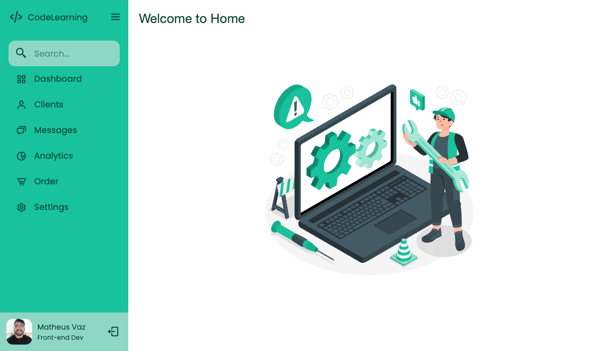

# Sidebar Project

> Trilha Explorer

Projeto desenvolvido durante os dias 18/09/2022 a 22/09/2022 como 1º desafio da mentoria **Conquiste Sua Vaga**, que consistiu em criar uma sidebar (barra de navegação lateral) responsiva (open/close).

[🔗 Clique aqui para acessar](https://matheusvaz-dev.github.io/sidebar/)

## 🛠️ Tecnologias

- HTML;
- CSS;
- Javascript.
- Git e Github.

## Boas práticas de UI

- Grid de 4px e 8px;
- Acessibilida de cores usando [Aspose](https://products.aspose.app/html/pt/contrast-checker).
- Heurísticas de Nielsen. Ex.: visibilidade de qual estado estamos no sistema.

## 📧 Contato

matheusvaz.ux@gmail.com
